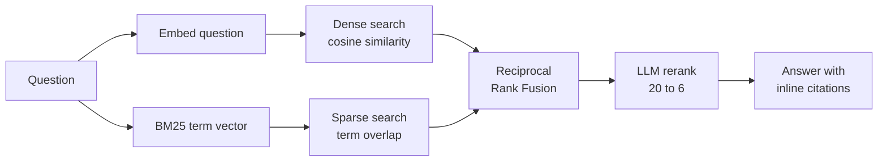

# SourceSync

Ask questions about your own PDFs and public GitHub repositories, and get
answers built only from what you indexed — every claim carrying a citation back
to the passage it came from.

The interesting part is not the chat box. It is the retrieval: SourceSync runs a
semantic search and a keyword search over the same corpus, merges the two
rankings with Reciprocal Rank Fusion, reranks the survivors with an LLM, and
only then answers. This README explains why each of those steps is there.

```
FastAPI · Qdrant · Gemini · React + Vite + Tailwind
```

---

## How a question is answered



**Why two searches.** A dense embedding places text by meaning, so it matches
"how do I stop the server" against a passage that only says "shutdown
procedure". But it reliably misses exact tokens — a function name, an error
code, a version number. Ask about `ensure_collection` and a dense-only search
returns passages about "setting up the database" while missing the function
itself. A sparse BM25 vector has the opposite blind spot: it matches words, not
meaning. Running both covers each other's failures.

**Why Reciprocal Rank Fusion.** The two searches return scores on completely
different scales — cosine similarity sits around 0 to 1, BM25 is unbounded and
routinely above 10 — so they cannot simply be added, and normalising them is
fragile because the ranges shift with every query. RRF throws the scores away
and keeps only the positions. A passage at rank `r` in a list contributes:

```
1 / (k + r)          with k = 60
```

and a passage's final score is the sum of its contributions across both lists.
Two things fall out of this. A passage that *both* searches return outranks one
that only a single search found, which is exactly the agreement signal hybrid
search exists to exploit. And because `k` is large, rank 1 scores 1/61 and rank
2 scores 1/62 — nearly identical — so one retriever that is confidently wrong
cannot dominate the merged ranking.

**Why rerank.** Fusion ranks a passage by *where it appeared*, which is a proxy
for relevance rather than a judgement of it. A model that reads the question and
the passage together catches what both retrievers get wrong: a passage full of
matching keywords that answers a different question. Twenty candidates go in,
six come out — which also keeps the answer prompt small.

The interface shows all of this. Each citation is labelled with which searches
found it, and "How was this retrieved?" expands to per-stage timings.

---

## Does it actually work better?

Claiming hybrid retrieval beats its parts is easy; `backend/evaluation/` measures
it. The corpus is this backend's own source tree, so the evaluation is
self-contained — no downloads, no fixtures — and ground truth is simply the file
each question is about. A configuration scores a hit when a passage from that
file lands in the top 5.

```bash
cd backend && python -m evaluation.evaluate
```

20 questions over 86 passages from 26 files:

| Retrieval | Hit@5 | MRR |
| --- | --- | --- |
| Semantic (dense) only | 100% | 0.875 |
| Keyword (BM25) only | 100% | 0.821 |
| Hybrid with RRF | 100% | 0.950 |
| Hybrid with RRF + rerank | 100% | **1.000** |

The ordering is what the design predicts: fusion beats either search alone, and
reranking puts the right passage first every time.

**Read this honestly.** The corpus is small enough that everything is findable,
which is why Hit@5 is saturated at 100% and MRR is the only metric doing any
discriminating. The questions were also written against the source rather than
collected from real users, so they share vocabulary with the passages they
target. This is a sanity check that the pipeline works and that each stage
helps — not evidence of performance on a large or adversarial corpus. Making it
harder (more documents, questions phrased without the source's own words) is the
obvious next step.

---

## Layout

```
backend/app/
  core/         Pure logic. No network, no database, no FastAPI.
    chunking.py     Splitting prose and code into overlapping passages
    sparse.py       Tokenising and BM25 term-frequency vectors
    fusion.py       Reciprocal Rank Fusion
    documents.py    PDF and text extraction, page by page
    repository.py   GitHub URL validation and archive filtering
  services/     One class per external system.
    embeddings.py   Gemini dense embeddings
    vectorstore.py  Qdrant: storage and both searches
    llm.py          Gemini reranking and answering
    github.py       Repository archive download
    pipeline.py     The pipeline, written down in order
  routers/      HTTP only. No logic.
```

The split is the point: everything in `core/` is deterministic and tested
offline with no API key, which is where the retrieval maths lives. Anything that
can fail because a network is involved sits behind a class in `services/`.

```bash
cd backend && python -m unittest discover -s tests -v   # 40 tests, no credentials needed
```

---

## Running it locally

Copy `.env.example` to `.env` and fill in the three credentials. Then:

```bash
cd backend && uv run uvicorn app.main:app --reload --port 8000
```

```bash
cd frontend && npm install && npm run dev
```

The API documents itself at `http://localhost:8000/docs`.

---

## Built for a free tier

Every one of these is a constraint that shaped the design, not an afterthought.

**768-dimension vectors.** The embedding model emits 3072 numbers per passage by
default and supports truncating to shorter widths natively. At 768 each vector
is four times smaller with very little retrieval loss — the difference between
fitting a free Qdrant cluster and not.

**Passage text stored on disk.** Passage text is the bulk of the stored bytes
and is never used for filtering, only returned with hits, so the collection sets
`on_disk_payload=True` and keeps RAM for the vectors.

**One collection, many sessions.** Isolation is a mandatory `session_id` filter,
and its payload index is declared with `is_tenant=True` so Qdrant stores each
session contiguously and the filtered search stays cheap instead of scanning.

**Model choice is a quota decision.** Free-tier request quotas are per model per
day, and the full `gemini-3.5-flash` allows only 20 generate calls a day — about
ten questions once reranking is counted. The default is `gemini-3.5-flash-lite`,
which has far more headroom and handles tightly-grounded answering well.
`RERANK_MODEL` can point the reranking step at a different model again.

**Reranking is skipped when it cannot help.** If fusion returned no more
candidates than the context budget, they are all going into the prompt anyway,
so the rerank call is not made. It costs a full round trip.

**Rate limits are told apart.** A 429 for a per-minute limit is retried with
backoff, honouring the delay Gemini asks for. A 429 for the per-day quota is
not — waiting cannot fix it, and each retry would spend another unit of the
budget to receive the same error.

**Sessions are signed, not stored.** The cookie carries the session id and
expiry signed with HMAC-SHA256; nothing is kept server-side. A free Render
instance sleeps after fifteen minutes, so an in-memory session store loses every
session regularly while the passages they indexed stay behind in Qdrant. A
signed cookie survives restarts and multiple workers, and is less code.

**Nothing is left behind.** Every passage carries the expiry of the session that
created it, so cleanup is one filtered delete at startup rather than a scheduler.

---

## Limits

| | |
| --- | --- |
| Documents | PDF, TXT, Markdown — 15 MB, 120 pages |
| Repositories | 20 MB archive, 400 indexable files, 256 KB per file |
| Per session | 4,000 passages, expiring after 60 minutes |

Scanned PDFs are rejected rather than silently indexed as empty: there is no OCR.

---

## Deploying

`render.yaml` defines both services. Set `QDRANT_URL`, `QDRANT_API_KEY` and
`GEMINI_API_KEY` on the API service, point `CORS_ORIGINS` at the deployed
frontend URL and `VITE_API_BASE_URL` at the deployed API URL. `SESSION_SECRET`
is generated by Render and must stay stable across deploys.

Note that `QDRANT_COLLECTION` defaults to `sourcesync_hybrid`. The collection
layout changed when hybrid search was added — dense and sparse are now *named*
vectors — so a collection created by an earlier version cannot be reused. The
app detects this at startup and says so rather than misbehaving quietly.

---

## What I would do next

- Harder evaluation: a larger corpus and questions that do not borrow the
  source's vocabulary, so Hit@k has room to discriminate.
- Stream the answer token by token; on a free tier the wait is dominated by
  generation, and streaming hides most of it.
- Cache query embeddings, so a repeated question skips a round trip.
- Multi-turn follow-ups, which need each question rewritten into a standalone
  query before retrieval.
